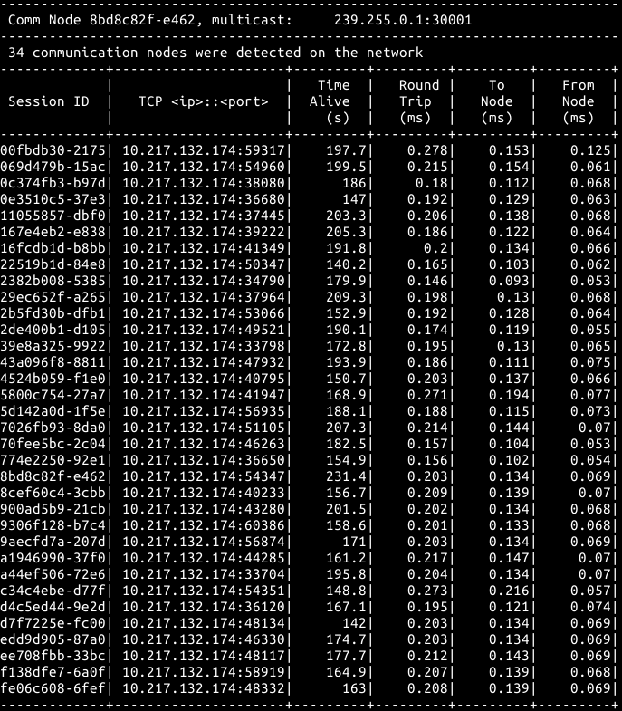

### Communications Node

# Overview

The communication node program allows seeing other communication nodes running on the same local area network. It uses UDP multicast messages ( [https://tools.ietf.org/html/rfc1112](https://tools.ietf.org/html/rfc1112)) for one-to-many communication and TCP messages for one-to-one communication. The implementation is done in C++11 with [boost::asio](http://www.boost.org/doc/libs/1_62_0/doc/html/boost_asio.html) as the main networking library. The implementation is primarily Linux based, but has also been tested on Windows. It allows for an arbitrary number of CNs and multiple CNs can run on the same machine.

# Program Design

Figure 1: Class diagram

The main design consists of six classes:

1. AsyncUdpMulticastSendingService – class that is responsible for sending the information about this communication node to others. The information is encoded as a JSON string in the following format:

{

  &quot;SessionId&quot;: &quot;e89a00ca-fa42-432c-8ce3-8149ea935b25&quot;,

  &quot;TcpServerPort&quot;: &quot;54829&quot;

}

The session ID is a unique identifier attributed to each CN, the TCP server port is a port assigned by the OS to this CN.

1. AsyncUdpMulticastListenService – other nodes are responsible for listening to incoming multicast, parsing the JSON and storing the session IDs and ports into a shared list.
2. CommNodeList – this is a shared directory for different threads to be able to add new CNs, delete non-responding CNs and finally to present them to the user.
3. AsyncTcpListenServer – this is a server with the TcpServerPort number referenced above. This asynchronous server responds to queries from other nodes.
4. SyncTcpNodeCommsClient – this is the only synchronous communications class. It uses blocking calls to try to measure the round-trip-time for each query and response.
5. CommNodeUi – this class presents the information to the user. In Linux this relies on ncurses and in Windows uses a system(&quot;clr&quot;) to present a continuous table.

# Build instructions

## Linux

In a Linux environment – make sure that git, boost, cmake and ncurses are installed. In Ubuntu:

sudo apt-get install libboost-all-dev libncurses5-dev

From the main directory - move to the build directory and then run cmake in it. The CMakeLists.txt script will automatically git-clone and build googletest  as part of the build process.

cd build

cmake ..

make

# run the program

./commsnode --help

## Windows

Dependencies:

1. 1)MinGW compiler suite with libboost: [https://nuwen.net/mingw.html](https://nuwen.net/mingw.html) unzip it to C:\MinGW and ensure that &quot;C:\MinGW\bin;C:\MinGW\git\bin&quot; is part of Windows %PATH%

The build can be done from the main directory with a simple Makefile – an example is provided in Makefile.windows

copy Makefile.windows Makefile

make

cd build

# run the program

Commsnode.exe --help

## Unit Tests

The unit tests will be built automatically on Linux. The cmake script will clone the latest [googletest](https://github.com/google/googletest) master from GitHub and build it in place.  Following that the unit tests will be built and can be run with

./test\_commsnode

The googletest cmake script is based on the following GitHub repository - [https://github.com/snikulov/google-test-examples](https://github.com/snikulov/google-test-examples).

## Networking Tools

In the tools directory two debugging tools are provided rx\_udp and rx\_tcp. They can be built using the Makefile.linux and Makefile.windows examples in the directory. These tools can be used to analyze the TCP and UDP messages being sent across the network.

#

 

Figure 2: Many nodes running on Linux

# TODOs
1) Properly wrap or encapsulate the network I/O calls. Also create mock classes ( [googlemock](https://github.com/google/googletest/tree/master/googlemock)) for unit testing for all of the network facing services. Currently only the classes that are completely internal to this application have unit tests.

2) While the round-trip-time is somewhat accurate (minus some time spent in the application layer), the estimated to and from times are relying on another CNs clock. This is problematic because the other clock might not be synced. Ideally this requires something like the IEEE 1588-2002 ( [Precision Time Protocol](https://en.wikipedia.org/wiki/Precision_Time_Protocol)) to synchronize all of the clocks on the network.

